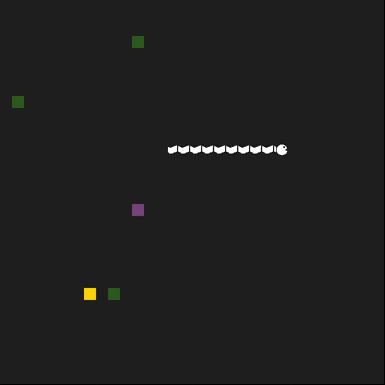

# CPPND: Capstone Snake Game Example

This snake game was developed for the Capstone project in the [Udacity C++ Nanodegree Program](https://www.udacity.com/course/c-plus-plus-nanodegree--nd213). The starter code for this repo was inspired by [this](https://codereview.stackexchange.com/questions/212296/snake-game-in-c-with-sdl) excellent StackOverflow post and set of responses.

The new features added to the starter game are:
* Added "Pause" functionality.
* Added a "Poison" that will decrease the score and shorten the length if the sanke ate it. If the snake has only head with no body attached, snake will die.
* Added "Moving Obstacles" that will kill the snake if they touch any part of the snake.
* Added a bmp image to the snake head.
* Added a bmp image to the snake body.

## Dependencies for Running Locally
* cmake >= 3.7
  * All OSes: [click here for installation instructions](https://cmake.org/install/)
* make >= 4.1 (Linux, Mac), 3.81 (Windows)
  * Linux: make is installed by default on most Linux distros
  * Mac: [install Xcode command line tools to get make](https://developer.apple.com/xcode/features/)
  * Windows: [Click here for installation instructions](http://gnuwin32.sourceforge.net/packages/make.htm)
* SDL2 >= 2.0
  * All installation instructions can be found [here](https://wiki.libsdl.org/Installation)
  >Note that for Linux, an `apt` or `apt-get` installation is preferred to building from source.
* SDL2_ttf >= 2.0
  * All installation instructions can be found [here](https://wiki.libsdl.org/SDL2_ttf/FrontPage)
  >Note that for Linux, an `apt` or `apt-get` installation is preferred to building from source. 
* gcc/g++ >= 5.4
  * Linux: gcc / g++ is installed by default on most Linux distros
  * Mac: same deal as make - [install Xcode command line tools](https://developer.apple.com/xcode/features/)
  * Windows: recommend using [MinGW](http://www.mingw.org/)

## Basic Build Instructions

1. Clone this repo.
2. Make a build directory in the top level directory: `mkdir build && cd build`
3. Compile: `cmake .. && make`
4. Run it: `./snakegame`.

## CC Attribution-ShareAlike 4.0 International

## Code Structure
The movingobstacle.cpp and gamestate.cpp files were added to the starter code. These classes added the moving obstacles feature and the different game states (running, paused, quit) to the game.

## How the submission satisfies the necessary rubric
Beside providing this README.md and the fact that the code is compiles and runs successfully, here are the 5 rubrics the project satisfies:
  
  ## 1/ Loops, Functions, I/O:
  * A variety of control structures are used in the project:
      * while lopp introduced in movingobstacle.cpp line 21
          while (true)
      * if statements in movingobstacle.cpp lines 25 - 39
          if (!snake.alive || gamestate == GameState::States::quit)
          {
            break;
          }
      * for-loop in movingobstacle.cpp line 71:
          for (auto &t : threads)
          {
            t.join();
          }
  * The project code is clearly organized into functions (As declared in movingobstacle.h):
      * The class MovingObstacle has 5 member functions (methods):
          void simulate(Snake &snake, GameState::States &gamestate);
          void PlaceMovingObstacle();
          void waitForUnpause(GameState::States &gamestate);
          SDL_Point GetMovingObstacle() const;
          void moveObstacle(Snake &snake, GameState::States &gamestate);

  ## 2/ Loops, Functions, I/O:
  * The project reads data from a file and process the data, or the program writes data to a file:
      * In renderer.cpp line 34, the code reads bmp file and process the data:
          surface = SDL_LoadBMP( "SnakeHead.bmp" );
  
  ## 3/ Object Oriented Programming:
  * The project code is organized into classes with class attributes to hold the data, and class methods to perform tasks:
      * Two new classes were introduced to the starter code; namely MovingObstacle class and GameState class. Each class has its own attributes and methods.

  ## 4/ Object Oriented Programming:
  * All class data members are explicitly specified as public, protected, or private:
      * The two introduced classes MovingObstacle class and GameState class have their data members specified as required.

  ## 5/ Memory Management:
  * At least two variables are defined as references, or two functions use pass-by-reference in the project code:
      * These two functions use pass-by-reference:
      void simulate(Snake &snake, GameState::States &gamestate);  // movingobstacle.h line 15
      void waitForUnpause(GameState::States &gamestate);          // movingobstacle.h line 17

  ## 6/ Memory Management:
  * The project uses at least one smart pointer: unique_ptr, shared_ptr, or weak_ptr. The project does not use raw pointers:
      * In game.h, the vector obstacles in a vector of shared_ptr:
      std::vector<std::shared_ptr<MovingObstacle>> obstacles;     // game.h line 25

  ## 7/ Concurrency:
  * The project uses multiple threads in the execution:
      * The moving obstacles in the game are threads that were declared in movingobstacle.h:
      std::vector<std::thread> threads;                           //movingobstacle.h line 22
      threads.emplace_back(std::thread(&MovingObstacle::moveObstacle, this, std::ref(snake), std::ref(gamestate)));
      //movingobstacle.cpp line 16

Shield: [![CC BY-SA 4.0][cc-by-sa-shield]][cc-by-sa]

This work is licensed under a
[Creative Commons Attribution-ShareAlike 4.0 International License][cc-by-sa].

[![CC BY-SA 4.0][cc-by-sa-image]][cc-by-sa]

[cc-by-sa]: http://creativecommons.org/licenses/by-sa/4.0/
[cc-by-sa-image]: https://licensebuttons.net/l/by-sa/4.0/88x31.png
[cc-by-sa-shield]: https://img.shields.io/badge/License-CC%20BY--SA%204.0-lightgrey.svg
